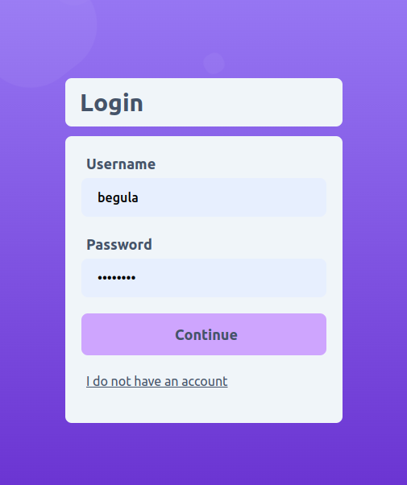

# openChat

### Synopsis

* This application is a chat interface where user can send messages to any of the other online user using sockets.
* The chat is encrypted using lattice based asymetric encryption system where public key can is accessed through sever and user has their private key locally.

NOTE: This application is made just for learning purposes and does not have any real life application in terms of security. Lattice encryption takes too much of computaion power!

## Techstack

#### Languages
	* Golang
	* Javascript
	
#### Frameworks / Modules
	* Fiber
	* Lattigo
	* React
	* Tailwind CSS
	
#### Technologies
	* Docker
	* Nginx
	* Websockify
	
## The Application

